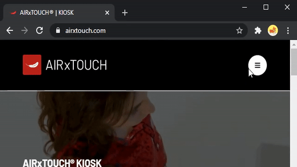
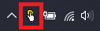

# AIRxTOUCH® Advanced developer guide for web applications

## ⚠ This library is only usefull if you own an AIRxTOUCH® device ⚠

## Prerequisite

- Read and understand the basic [developer guidelines](https://airxtouch.com/pdfs/AIRxTOUCH_KIOSK_Dev_Guidelines.pdf)

## Features

- Use the zoom (simulation of ctrl + mousewheel)
- Define dynamically your application layout
- Enable hover interaction

## Install the AIRxTOUCH Proxy browser extension

In order to communicate with the driver with a web app, you need to install our 
[browser extension ](https://chrome.google.com/webstore/detail/airxtouch-proxy/igbmmjnkkhinkolghjhajbbpppgkbbim)

## Activate the extension on your application

- For debug purposes we recommand to pin the extension icon on your browser
- While on your application, authorize the extension to interact with your page by clicking on the extension icon (red feather)
- Click `Accept` on the popup 




Keep in mind that this only authorize the current url on your device. You'll need to repeat this action on every AIRxTOUCH® device for every application.

## Initialize the connection with the driver in your code

To interact with the driver, add the following div to your code
```html
<div
  id="airxtouch-proxy"
  style="display: none"
>
</div>
```
- The id **must** be `airxtouch-proxy`
- The div must be available when the DOM is loaded

If you did it properly, you will see a badge on the extension icon with the "ON" label. You will also see the following line in your console : `AIRxTOUCH proxy configuration detected`

 If the background color of the badge is green, it means that the communication with the driver is successfull 

 If the background color of the badge is red, it means the communication with the driver is not established.

If you are not currently running your application (eg development environnement) on a AIRxTOUCH® device you can ignore this. 

If you are running you are running your application on a AIRxTOUCH® device, make sure the driver is launched (icon in system tray) 

## Interact with the driver in your code

Install our library

```cmd
npm install airxtouch-toolkit-proxy --save
```

This library contain all the enums and objects you'll need to interact with the driver

```js
import {
  AIRxTouchInteractionMode,
  AIRxTouchDefaultLayoutSetting,
  GetElementBounds
} from "airxtouch-proxy-helper";
```

You can interact with the driver by adding and editing attributes on the `airxtouch-proxy` div that you previously added

| Attribute | Description | Required  |
| ------------- |-------------|:-----:|
| data-appid      | Your uniq application id (can be the application name) | ✔ |
| data-fulllayout | **AIRxTouchDefaultLayoutSetting** (enum from package)|     |
| data-interactionmode | **AIRxTouchInteractionMode** (enum from package)|     |
| data-hoverinteraction | **Boolean**. Default to false  |     |
| data-layout | Array of **AIRxTouchLayoutSetting**, can be generated using **GetElementBounds**. used when you need differents layout setting on the same page. (More details on the examples) |     |

## Code examples

[Simple example](https://codesandbox.io/s/airxtouch-toolkit-simple-example-lk3sf?file=/src/index.js)
: Init config and toggle simple options

[data-layout example ](https://codesandbox.io/s/airxtouch-toolkit-advanced-example-6uv9s?file=/src/index.js)
: How to use **data-layout** & **GetElementBounds**

## Live example

**Use on your AIRxTOUCH® device with our [extension installed and activated](#install-the-airxtouch-proxy-browser-extension)**

Check ideal use cases and examples for the differents interaction modes at the following url 

https://proxy-sample.airxtouch.com

